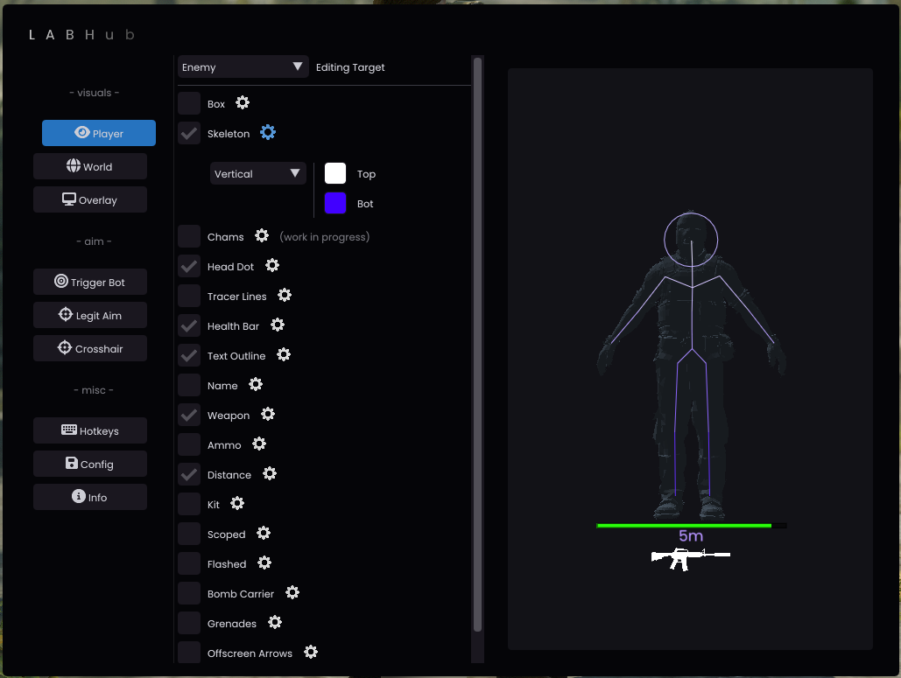
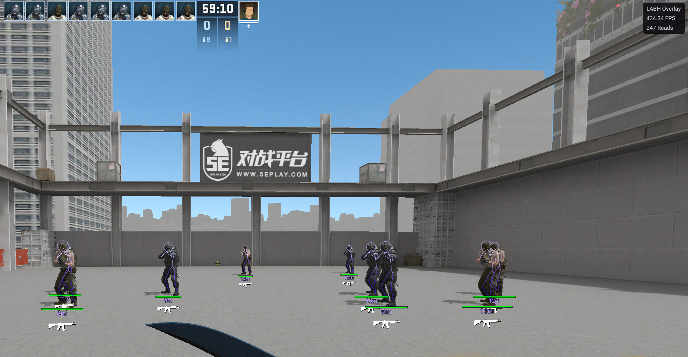
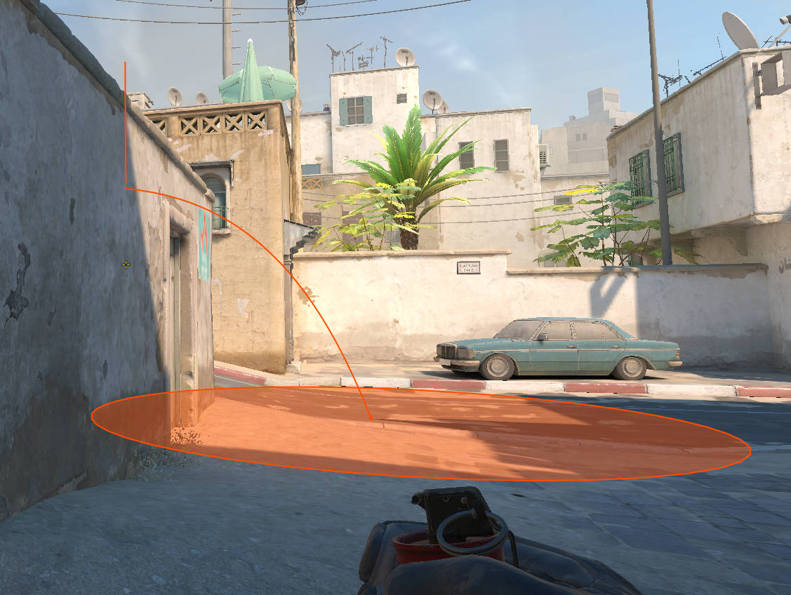

# LABHub

LabHub is an open source external Counter-Strike 2 read only kernel-level gameplay enhancer.  
That's a lot of descriptive words, but what does each of them mean?  
- `LabHub` The name of this project
- `open source` This application is open source and for everyone to learn from
- `external` We do not inject any DLLs into the target process
- `read only` We do not write to the CS2 process in any way, therefore being impossible to detect by scanning the process memory
- `kernel` We do not use any user level WinAPIs in order to get information from the CS2 process
  
This project is mainly a fun example for exploring the Windows Kernel with [Rust](https://www.rust-lang.org) and exploring the world of game enhancements :)
  
# Features
Due to LabHub being read-only (as of now), there are limitations on what features are possible to implement (eg. skin changer).
Regardless of this limitation, LabHub supports the following features:  

- **Legit Aim**
  - Smooth aim assistance with configurable FOV and smoothing
  - Bone selection (Head, Neck, Spine, Pelvis)
  - Activation key binding
- **Visuals / ESP**  
  - Player ESP with configuration possibilities like: `Skeleton`, `Boxes3D` and `Boxes2D` 
  - Configurable colors to distinguish between enemy and team players
  - ESP includes player health, a health bar, weapon and a lot more
- **World**
  - **Grenade Trajectory**: Helper to see grenade paths
  - **Bomb Info**: Time until detonation, defuse timer, and bomb site location
- **Trigger Bot**  
  - Shoot your enemy (or team mates) as soon they enter your crosshair
  - Configurable delays and burst duration
  - Team check and Recoil Helper
- **Misc**
  - **Sniper Crosshair**: Custom crosshair for snipers with size, thickness, and color customization
  - **Spectator List**: See who is currently watching you
  - **Stream Proof**: Never show your LabHub overlay on any screen shares or captures
  - **Watermark**: Optional overlay watermark

To access LabHub settings overlay press `insert`.

# Troubleshooting
If you are having any issues join the discord and shoot me a message or type in the general chat and @ me

# Screenshots

# Help
You can find help on the official LabHub Discord server:  

